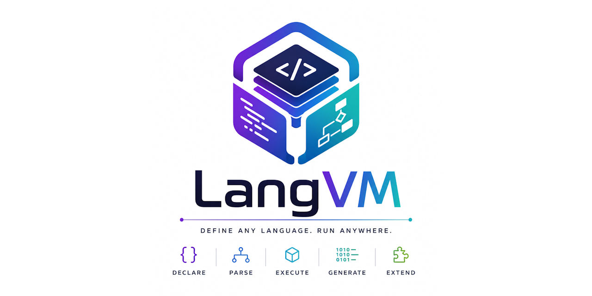

<div align="center">



[](https://discord.gg/Wb6z8Wam7p) [](https://bsky.app/profile/tinybiggames.com)

</div>

## What is LangVM?

**A scriptable language workbench that takes you from language idea to native binary -- entirely from script.** Write a `.lvm` script that defines your language's tokens, grammar, semantic rules, and code generation. LangVM executes that script and becomes a working implementation of whatever language you defined. Change the script, change the language. No recompilation of the VM itself.

```lvm
language TestLang version "1.0";

tokens {
  casesensitive = true;
  token keyword.say = "say";
  token delimiter.semicolon = ";";
  token string.default = "\"";
}

grammar {
  rule stmt.say {
    expect keyword.say;
    let text: string = currentText();
    advance();
    let nd: handle = getResultNode();
    setAttr(nd, "message", text);
    requireToken("delimiter.semicolon");
  }
}

emitters {
  on stmt.say {
    println(getAttr(node, "message"));
  }
}

routine main() {
  let source: string = 'say "hello"; say "world";';
  let toks: any = lexSource(source, "test.say");
  let ast: any = parseProgram(toks, "test.say");
  runEmitters(ast);
}
```

Run it:

```bash
lvm -l saylang.lvm
```

The `.lvm` scripting language is **Turing complete**. This is not a configuration format or a template language -- it is a full programming language with variables, control flow, recursion, data structures, and ~200 builtins. Turing completeness is what makes the entire architecture possible: the x86_64 instruction encoder (890 lines), the PE image writer (928 lines), the ELF writer (1498 lines), and the ABI handling (521 lines) are all written in `.lvm` scripts.

The pipeline has five stages, all defined in `.lvm` script: `tokens{}` configures the lexer, `grammar{}` defines Pratt parser rules, `semantics{}` runs analysis passes, `emitters{}` generates code (emitting MIR assembly instructions), and `mir{}` on-handlers lower those virtual assembly instructions to real x86_64 machine code. The entire native backend -- instruction encoding, Win64/SysV ABI, PE/ELF/COFF image writing -- lives in ~165KB of `.lvm` script.

LangVM is also embeddable. Delphi applications can create a `TLangVM` instance, load a script, register custom builtins, and call routines through a clean public API.


## 🎯 Who is LangVM For?

- **Language designers**: Prototype a language without building a compiler. Define your syntax in `tokens{}` and `grammar{}`, add semantics and code generation, and get a working implementation immediately.
- **Compiler writers**: Use LangVM as a scriptable frontend and backend. The pipeline architecture handles lexing, parsing, semantic analysis, and native code generation -- all configurable at runtime.
- **Tool builders**: Embed `TLangVM` in a Delphi application and give it a scriptable language engine. Register custom builtins, exchange data through well-known globals, and capture output and diagnostics through callbacks.
- **Educators**: Teach compiler construction with a system where every stage of the pipeline is visible, editable, and executable. Students can modify a language definition and see the effects immediately.
- **Anyone who wants to go from "I have a language idea" to "I have a native binary" without leaving script.**


## ✨ Key Features

- **Turing-complete scripting**: The `.lvm` language has variables, control flow, recursion, lists, maps, buffers, records, enums, routines, imports, and ~200 builtins. It is a full programming language, not a config format.
- **Pipeline architecture**: Five scriptable stages -- `tokens{}`, `grammar{}`, `semantics{}`, `emitters{}`, `mir{}` -- define your entire language from lexer to native code generator.
- **Runtime-configurable lexer and parser**: LangVM's generic lexer and Pratt parser configure themselves from your `tokens{}` and `grammar{}` declarations at runtime. No code generation step, no separate parser generator.
- **MIR virtual assembly**: A complete virtual CPU assembly language with typed registers, arithmetic, comparison, branching, calling conventions, memory operands, and more. Emitters produce MIR; backend scripts lower it to real machine code.
- **Backend in script**: The entire x86_64 native backend -- instruction encoder, Win64/SysV ABI, PE64 image writer, ELF64 image writer, COFF .obj writer -- is written in `.lvm` scripts (~165KB total). No Delphi code in the backend.
- **End-to-end proven**: `mir_full_pipeline.lvm` demonstrates the complete chain in 181 lines: define a language, parse source, emit MIR, lower to x64, write a PE executable, and run it.
- **Zero dependencies**: The VM runtime is a single Delphi unit (`LangVM.pas`, ~13K lines). No external libraries, no build system, no toolchain installation.
- **Embeddable**: `TLangVM` provides a clean Delphi API -- `Create`, `LoadScriptFile`, `Run`, `SetVar`/`GetVar`, `RegisterBuiltin`, callbacks for output and diagnostics.
- **Semantic analysis**: Scope management, symbol declaration, type checking, and attribute stamping via `semantics{}` on-handlers with `scope`, `declare`, `lookup`, `visit`, and diagnostic builtins.
- **Binary data construction**: Buffer builtins (`bufWriteU8`..`bufWriteU64`, `bufWriteRecord`, `bufSave`, `bufIsExec`, `bufCall`) enable constructing and executing binary data from script -- essential for native code generation.
- **Structured error handling**: `try/recover` for runtime errors, plus `error`/`warning`/`hint`/`note`/`info` diagnostic builtins for semantic analysis.
- **Import system**: `.lvm` files can import other `.lvm` files. The entire x86_64 backend is composed from 7 imported scripts.


## 🚀 Getting Started

Every `.lvm` file starts with a `language` declaration and has a `routine main()` entry point. The simplest script:

```lvm
language 1 version "1.0.0";

routine main() {
  println("Hello, LangVM!");
}
```

Run it:

```bash
lvm -l hello.lvm
```

To define a language, add pipeline blocks. Here is a complete language that parses `say "text";` statements and prints the text:

```lvm
language SayLang version "1.0";

tokens {
  casesensitive = true;
  token keyword.say = "say";
  token delimiter.semicolon = ";";
  token string.default = "\"";
  token comment.line = "//";
}

grammar {
  rule stmt.say {
    expect keyword.say;
    let text: string = currentText();
    advance();
    let nd: handle = getResultNode();
    setAttr(nd, "message", text);
    requireToken("delimiter.semicolon");
  }
}

semantics {
  on stmt.say {
    setShared("last_message", getAttr(node, "message"));
  }
}

emitters {
  on stmt.say {
    println(getAttr(node, "message"));
  }
}

routine main() {
  let source: string = 'say "hello"; say "world";';
  let toks: any = lexSource(source, "test.say");
  let ast: any = parseProgram(toks, "test.say");
  runEmitters(ast);
}
```

The same architecture scales to production languages. The Myrissa language definition is 5,000+ lines of pipeline script defining 70+ keywords, a full Pratt parser grammar, semantic analysis, and native code generation via MIR.


### CLI Reference

```bash
lvm -l <script.lvm> [options]
```

| Flag | Description |
|------|-------------|
| `-l, --lang <file>` | LVM script file (.lvm) [required] |
| `-s, --source <file>` | Source file for the script to process [optional] |
| `-h, --help` | Display help |

```bash
lvm -l hello.lvm                    # run a script
lvm -l mylang.lvm -s input.src      # run a language definition against a source file
```

### Embedding in Delphi

```delphi
uses
  LangVM;

var
  LVM: TLangVM;
begin
  LVM := TLangVM.Create();
  try
    LVM.LoadScriptFile('mylang.lvm');
    LVM.SourceFilename := 'input.src';
    LVM.Run('main');
    WriteLn('Exit code: ', LVM.ExitCode);
  finally
    LVM.Free();
  end;
end;
```


## 📖 Documentation

The full language reference, BNF grammar, pipeline blocks reference, MIR reference, builtins catalog, host API reference, and how-to recipes are in a single document:

| Document | Description |
|----------|-------------|
| **[LangVM](https://github.com/tinyBigGAMES/LangVM/blob/main/docs/LangVM.md)** | Complete reference: the `.lvm` scripting language, pipeline blocks (`tokens`, `grammar`, `semantics`, `emitters`, `mir`), MIR virtual assembly, all ~200 builtins, the Delphi host API, formal BNF grammar, code style guide, and practical how-to recipes. |


## 🔨 Getting LangVM

### Get the Source

```bash
git clone https://github.com/tinyBigGAMES/LangVM.git
```

Or download the repository as a [ZIP](https://github.com/tinyBigGAMES/LangVM/archive/refs/heads/main.zip) from GitHub.

### Prerequisites

| | Requirement |
|---|---|
| **Host OS** | Windows 10/11 x64 |
| **Compiler** | Delphi 12.x or higher |
| **Runtime dependencies** | None |

### Build

1. Open the project in the Delphi IDE
2. Build the Testbed project: `projects\Testbed\`
3. Build the LVM CLI project: `projects\LVM\`
4. Or use the build scripts: `bin\build-testbed.cmd` and `bin\build-lvm.cmd`

### Run the Tests

```bash
bin\build-testbed.cmd
Testbed.exe -all -q
```

The test suite covers builtins, control flow, data structures, declarations, error handling, expressions, routines, types, variables, MIR, and backend integration.

### System Requirements

| | Requirement |
|---|---|
| **Host OS** | Windows 10/11 x64 |
| **Runtime dependencies** | None |
| **External toolchain** | None |


## 🤝 Contributing

LangVM is an open project and contributions are welcome at every level:

- **Report bugs**: Open an issue on GitHub with a minimal `.lvm` reproduction case.
- **Suggest features**: Describe the use case first, then the syntax you have in mind.
- **Submit pull requests**: Bug fixes, documentation improvements, new test cases, and well-scoped features.
- **Review and discuss**: Reviewing open pull requests and issues helps move the project forward.

Join our [Discord](https://discord.gg/Wb6z8Wam7p) to discuss development, ask questions, or share what you are building with LangVM.


## 💙 Support the Project

If LangVM saves you time, sparks an idea, or becomes part of something you ship:

- **Star the repo** -- helps others find the project
- **Spread the word** -- write a post, mention it on social media
- **Join us on [Discord](https://discord.gg/Wb6z8Wam7p)** -- share what you are building
- **Become a sponsor** via [GitHub Sponsors](https://github.com/sponsors/tinyBigGAMES) -- directly funds development


## 📄 License

LangVM is licensed under the **Apache License 2.0**. See [LICENSE](https://github.com/tinyBigGAMES/LangVM?tab=Apache-2.0-1-ov-file#License-1-ov-file) for details.


## 🔗 Links

- [Homepage](https://langvm.org)
- [Discord](https://discord.gg/Wb6z8Wam7p)
- [Bluesky](https://bsky.app/profile/tinybiggames.com)
- [tinyBigGAMES](https://tinybiggames.com)

<div align="center">

**LangVM**&trade; - Language Virtual Machine

Copyright &copy; 2026-present tinyBigGAMES&#8482; LLC
All Rights Reserved.

</div>
